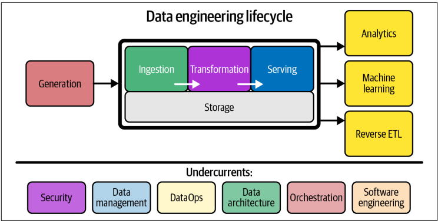
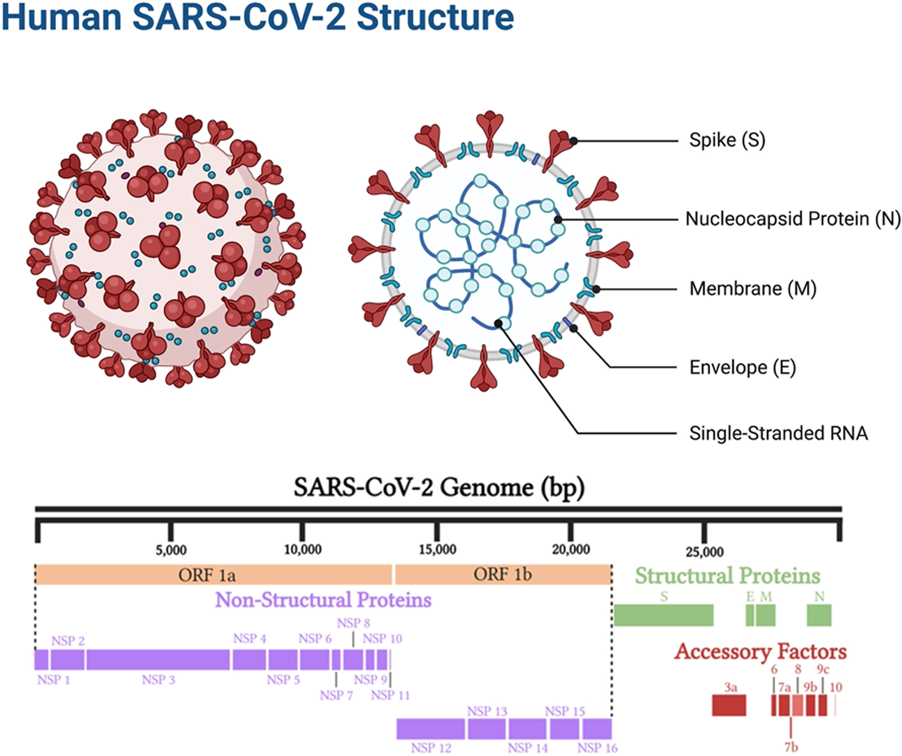
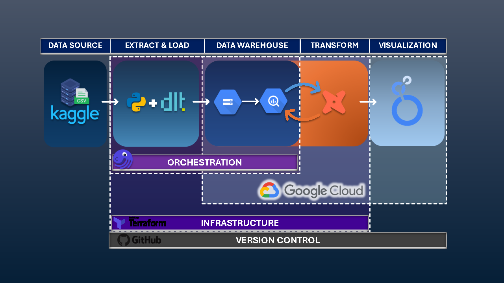

# COVIDEpidemetrics Healthcare Pipeline

## Data Engineering ZoomCamp 2025 Final Project
### Overview
This project implements an end-to-end data pipeline processing COVID-19 data from Kaggle. The pipeline follows a batch processing approach, ingesting data into a data lake on GCP, transforming it using dbt with a medallion architecture, and visualizing insights through Looker dashboards.



### Problem Statement
The COVID-19 pandemic created unprecedented challenges for healthcare systems worldwide. As coronavirus infections spread, healthcare providers faced critical shortages of medical resources and struggled with efficient distribution of limited supplies. Massive volumes of patient data were generated daily in inconsistent formats, making it difficult to derive actionable insights. Healthcare professionals need reliable analytics to identify high-risk patients early, predict resource requirements, and allocate medical attention where it's most urgently needed. Without structured data processing systems, potentially life-saving patterns remain hidden in the data.



### Vision and Impact
This data pipeline aims to create a foundation for pandemic preparedness and response. By transforming raw COVID-19 data into structured, analytics-ready formats, the pipeline enables powerful downstream applications. Machine learning models can then be trained on this processed data to predict patient outcomes, forecast resource needs, and identify high-risk populations. These predictive capabilities will be crucial for healthcare systems to quickly identify and establish an underlying pattern, resulting in more effective respones to future pandemics and allowing for earlier interventions, better resource allocation, and ultimately, improved patient outcomes. The pipeline's scalable architecture ensures that as new data sources become available, they can be incorporated to continuously enhance predictive accuracy and broaden analytical insights.

### Use Cases
This pipeline serves multiple stakeholders including:
- **Healthcare Providers**: Predict resource needs (ventilators, ICU beds) based on patient risk profiles
- **Hospital Administrators**: Optimize staff and equipment allocation based on predicted patient requirements
- **Public Health Officials**: Identify demographic patterns in high-risk cases to guide preventive measures
- **Researchers**: Analyze correlations between pre-existing conditions and COVID-19 severity outcomes

### Data Dictionary
Data can be found on Kaggle from this [COVID19 Dataset](https://www.kaggle.com/datasets/meirnizri/covid19-dataset).
| Feature | Description | Values |
|---------|-------------|--------|
| sex | Patient's biological sex | 1 = female, 2 = male |
| age | Age of the patient | Numeric value |
| classification | COVID test result category | 1-3 = positive (different degrees), 4+ = negative/inconclusive |
| patient_type | Care type received | 1 = outpatient (returned home), 2 = hospitalization |
| pneumonia | Air sacs inflammation | 1 = yes, 2 = no |
| pregnancy | Pregnancy status | 1 = yes, 2 = no |
| diabetes | Diabetes status | 1 = yes, 2 = no |
| copd | Chronic obstructive pulmonary disease | 1 = yes, 2 = no |
| asthma | Asthma status | 1 = yes, 2 = no |
| inmsupr | Immunosuppression status | 1 = yes, 2 = no |
| hypertension | Hypertension status | 1 = yes, 2 = no |
| cardiovascular | Heart or blood vessel disease | 1 = yes, 2 = no |
| renal_chronic | Chronic renal disease | 1 = yes, 2 = no |
| other_disease | Other disease presence | 1 = yes, 2 = no |
| obesity | Obesity status | 1 = yes, 2 = no |
| tobacco | Tobacco use | 1 = yes, 2 = no |
| usmr | Medical unit level | Values representing 1st, 2nd, or 3rd level |
| medical_unit | National Health System institution type | Categorical values |
| intubed | Ventilator use | 1 = yes, 2 = no |
| icu | Intensive Care Unit admission | 1 = yes, 2 = no |
| date_died | Date of death if applicable | Date format or 9999-99-99 if survived |

*Note: This data dictionary is based on the initial CSV file. The final table structure and content may vary depending on the data transformations and cleaning applied during the pipeline process.*

### Project File Structure
```
de-healthcare-pipeline/
│
├── terraform-iac/                  # Infrastructure as code
│   ├── main.tf
│   └── variables.tf
│
├── dlt-gcp-ingestion/              # Data ingestion components
│   ├── kaggle_dlt_extraction_load.py
│   └── kaggle_dlt_extraction_load.jpynb
│
├── dagster-orchestration/                     # Workflow orchestration
│   ├── dagster_project/
│   │   ├── __init__.py
│   │   ├── assets.py
│   │   └── schedules.py
│   ├── README.md
│   ├── requirements.txt
│   ├── setup.py
│   └── workspace.yaml
│
├── dbt-transformations/                        # Data transformation
│   ├── dbt_project.yml
│   └── models/
│       ├── staging/
│       │   ├── schema.yml
│       │   ├── sources.yml
│       │   └── stg_stilver__patients.sql
│       ├── intermediate/
│       │   ├── schema.yml
│       │   └── int__normalized_patients.sql
│       └── marts/
│           ├── dimensions/
│           │   ├── schema.yml
│           │   └── dim_date_sql
│           └── facts/
│               ├── schema.yml
│               ├── fct__comorbidites_outcomes.sql
│               ├── fct__deathes_age_time.sql
│               ├── fct__deaths_recoveries_age.sql
│               └── fct__recoveries_risk_age.sql
│    
└── looker-dashboard/                  # Data visualization
    ├── COVIDEpidemetrics.pdf
    ├── comorbidities_outcome.png
    ├── deaths_by_age_group2020.png
    ├── patient_type_recovery.png
    └── recovery_by_age_risk.png
```

### Technological Components

#### Data Pipeline Architecture
The COVID-19 data pipeline follows a modern data lakehouse approach with a pseudo-medallion architecture (bronze, silver, gold layers) but following the format as "staging", "intermediate", and "marts" respectively. Data is first downloaded from Kaggle as a CSV file and then ingested through dlt into the Google Cloud Storage bucket and then into BigQuery (staging), cleaned and standardized using dbt in BigQuery (intermediate), and then transformed into analytics-ready datasets (marts). The entire workflow is orchestrated by Dagster, with cloud infrastructure managed through Terraform.



#### Pipeline Tech Infrastructure

| Component | Description | Usage | Benefits |
|-----------|-------------|-------|----------|
| **Terraform** | Infrastructure as Code (IaC) tool | Provisioning and managing cloud resources | Ensures reproducible infrastructure setup, version control for infrastructure, and reduced configuration errors |
| **Data Load Tool (DLT)** | Python-based data ingestion framework | Extracting data from Kaggle and loading into GCS | Simplifies data extraction with built-in schema handling and incremental loading capabilities |
| **Google Cloud Platform (GCP)** | Cloud computing platform providing infrastructure and managed services | Hosting all components of our data pipeline | Offers seamless integration between services, scalability, and managed solutions for big data |
| **Google Cloud Storage (GCS)** | Object storage service | Data lake storage (bronze layer) | Scalable, durable storage for raw data files with strong integration to BigQuery |
| **BigQuery** | Serverless, scalable data warehouse | Storing processed data and enabling fast analytics | Handles large-scale data processing with columnar storage and SQL interface |
| **dbt (Data Build Tool)** | Transformation tool following ELT (Extract, Load, Transform) pattern | Implementing medallion architecture and transformations | Enables version-controlled, testable data transformations using SQL |
| **Dagster** | Data orchestrator for modern data platforms | Orchestrating pipeline execution | Provides modular, Python-native workflows with strong observability and debugging capabilities |
| **Looker Studio** | Business intelligence and data visualization platform | Creating interactive dashboards | Direct integration with BigQuery and powerful visualization capabilities |

## Steps to Reproduce

### 1. Pre-requisites

#### Clone the Repository
To get started, clone this repository to your local machine:
```bash
git clone https://github.com/your-repo/de-healthcare-pipeline.git
cd de-healthcare-pipeline
```

### 2. Google Cloud Platform (GCP) Setup

#### A. Create a GCP Project
1. Go to the [Google Cloud Console](https://console.cloud.google.com/).
2. Create a new project and note the project ID and project number.
3. Enable billing (requires a credit card, but you can use free credits).

#### B. Create Service Account and Authorization
1. Navigate to **IAM & Admin > Service Accounts**.
2. Create a new service account:
   - **Service Account Name**: Choose a descriptive name that reflects the purpose of the service account.
   - **Service Account ID**: This will be auto-generated but can be customized.
3. Grant the service account the following permissions:
   - Viewer
   - Storage Admin
   - Storage Object Admin
   - BigQuery Admin
   - Compute Admin
4. Create and download the JSON format key file.
5. Save the key file to a secure location.

#### C. Set Up Local Authentication
Set the environment variable pointing to your service account key:
```bash
export GOOGLE_CREDENTIALS="path/to/your/service-account-key.json"
```
Refresh the token and verify identity:
```bash
gcloud auth application-default login
```

#### D. Enable Required APIs
Enable the following APIs in the GCP console:
- Compute Engine API
- BigQuery API
- Cloud Storage API
- Identity and Access Management (IAM) API
- IAM Service Account Credentials API

### 3. Infrastructure as Code (IaC) with Terraform

The `terraform-iac` folder contains the Terraform configuration files for setting up the required GCP infrastructure. Follow these steps:

1. **Install Terraform**:
   - Download and install Terraform from the [official website](https://www.terraform.io/downloads).
   - Verify the installation:
     ```bash
     terraform -v
     ```

2. **Initialize Terraform**:
   - Navigate to the `terraform-iac` directory:
     ```bash
     cd terraform-iac
     ```
   - Initialize the Terraform working directory:
     ```bash
     terraform init
     ```

3. **Review and Apply Configuration**:
   - Review the Terraform plan to see the resources that will be created:
     ```bash
     terraform plan
     ```
   - Apply the configuration to create the resources:
     ```bash
     terraform apply
     ```
   - Confirm the prompt to proceed with the resource creation.

4. **Resources Created**:
   - Google Cloud Storage bucket for raw data (bronze layer).
   - BigQuery dataset for staging, intermediate, and marts layers.
   - Service accounts with the necessary permissions.

5. **Verify Infrastructure**:
   - Check the GCP Console to ensure the resources have been created successfully.

By using Terraform, you ensure that the infrastructure setup is reproducible and version-controlled, reducing the chances of configuration errors.

### 4. Data Ingestion with DLT

The `dlt-gcp-ingestion` folder contains Python scripts for ingesting data from Kaggle into Google Cloud Storage. Follow these steps:

1. **Install Dependencies**:
   Install the required Python packages:
   ```bash
   pip install -r dlt-gcp-ingestion/requirements.txt
   ```

2. **Set Up Kaggle API Key**:
   - Place your Kaggle API key (`kaggle.json`) in the `dlt-gcp-ingestion/kaggle/` directory.

3. **Run the Ingestion Script**:
   Execute the script to download and upload data to GCS:
   ```bash
   python dlt-gcp-ingestion/kaggle_dlt_extract_load.py
   ```
   This script performs the following:
   - Downloads the COVID-19 dataset from Kaggle.
   - Uploads the raw data to a GCS bucket (bronze layer).

### 5. Data Transformation with dbt

The `dbt-transformations` folder contains SQL models for transforming data in BigQuery. Follow these steps:

1. **Set Up dbt Profile**:
   - Update the `profiles.yml` file with your GCP project details and authentication credentials.

2. **Run dbt Commands**:
   - Navigate to the `dbt-transformations` directory:
     ```bash
     cd dbt-transformations
     ```
   - Execute the following commands:
     ```bash
     dbt run       # Run all models
     dbt test      # Run tests to validate data
     dbt docs generate  # Generate documentation
     ```
   - The dbt models implement a medallion architecture:
     - **Staging**: Raw data is cleaned and standardized.
     - **Intermediate**: Data is normalized and enriched.
     - **Marts**: Analytics-ready datasets are created.

### 6. Orchestration with Dagster

The `dagster-orchestration` folder contains the Dagster project for orchestrating the pipeline. Follow these steps:

1. **Install Dagster**:
   Install Dagster and its dependencies:
   ```bash
   pip install -r dagster-orchestration/requirements.txt
   ```

2. **Run Dagster**:
   - Start the Dagster UI:
     ```bash
     dagit -f dagster-orchestration/workspace.yaml
     ```
   - Open the Dagster UI in your browser at `http://localhost:3000`.

3. **Execute the Pipeline**:
   - Use the Dagster UI to trigger the pipeline.
   - Dagster orchestrates the following steps:
     - Schedule the data ingestion from Kaggle to GCS.
     - Validation and monitoring of pipeline execution.

### 7. Visualization with Looker Studio

1. **Connect to BigQuery**:
   - Open Looker Studio and create a new report.
   - Connect to your BigQuery project and select the analytics-ready datasets from the marts layer.

2. **Create Dashboards**:
   - Design interactive dashboards to visualize key metrics and insights.


### Scalability, Visualization, and Future Applications

This data engineering pipeline is designed with scalability and future applications in mind. By transforming raw COVID-19 data into structured, analytics-ready datasets, it enables seamless integration with visualization tools like Looker Studio. These visualizations provide actionable insights for stakeholders, such as healthcare providers and public health officials, to make data-driven decisions.

#### Scalability for Machine Learning
The pipeline's architecture supports future applications, including machine learning. The analytics-ready datasets in the marts layer can be used to train predictive models for tasks such as:
- Forecasting patient outcomes.
- Predicting resource requirements (e.g., ICU beds, ventilators).
- Identifying high-risk populations for targeted interventions.

As new data sources become available, the pipeline can be scaled to incorporate them, ensuring continuous improvement in predictive accuracy and analytical insights.

#### Orchestration and Automation
The pipeline leverages Dagster for orchestration, enabling automated workflows that reduce manual intervention. Currently, Dagster schedules the ingestion of data from Kaggle at 2 AM daily, ensuring timely updates for batch processing. This schedule can be easily modified to support streaming data ingestion, allowing for near real-time updates and always up-to-date information.

#### Batch Processing and Future Streaming
The pipeline follows a batch processing approach, where data is ingested, transformed, and loaded into BigQuery in scheduled intervals. This approach is ideal for handling large volumes of data efficiently. However, the architecture is flexible enough to transition to a streaming model if needed, enabling real-time analytics for scenarios requiring immediate insights.

By automating dbt transformations and integrating them into the orchestration workflow, the time required to prepare data for analytics can be further reduced. This ensures that stakeholders have access to the latest insights with minimal delay, enhancing the pipeline's overall efficiency and utility.