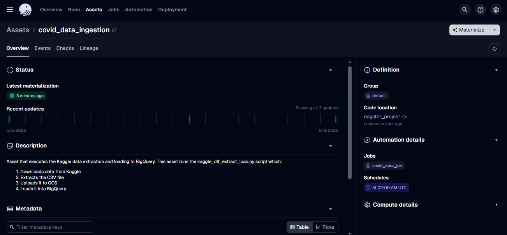

# Dagster Orchestration for Healthcare Data Pipeline

This directory contains the Dagster orchestration setup for the healthcare data pipeline. The orchestration is configured to run the Kaggle data extraction and loading process on a schedule.

## Why Dagster?

Dagster is a modern orchestration platform that stands out for its Python-native approach and developer-friendly features. Here’s why it is an excellent choice for orchestrating data pipelines:

1. **Python-Native**: 
  - Dagster is built with Python, making it a natural fit for data engineers and scientists who are already familiar with the language. This eliminates the need to learn a new domain-specific language (DSL) or tool-specific syntax.
  - Python's rich ecosystem of libraries (e.g., Pandas, NumPy, and PySpark) can be seamlessly integrated into Dagster pipelines.

2. **Type-Safe and Declarative**:
  - Dagster encourages type annotations, which help catch errors early and improve code readability.
  - Its declarative API allows you to define data dependencies explicitly, making pipelines easier to understand and maintain.

3. **Integrated Testing**:
  - Dagster provides built-in tools for testing pipelines, enabling you to validate individual components (e.g., assets, schedules) in isolation.
  - This ensures higher reliability and reduces the risk of runtime failures.

4. **Rich Observability**:
  - Dagster offers detailed logs, metrics, and visualizations through its UI, making it easier to monitor and debug pipelines.
  - The ability to track data lineage helps in understanding how data flows through the pipeline.

5. **Dynamic Scheduling**:
  - With Dagster, you can define schedules and sensors in Python, giving you full control over when and how pipelines are triggered.
  - Its flexibility allows you to adapt to changing requirements without significant rework.

6. **Community and Extensibility**:
  - Dagster has an active community and supports integrations with popular tools like Apache Spark, dbt, and cloud platforms.
  - Its modular design allows you to extend functionality as needed.

By leveraging Dagster, you can build robust, maintainable, and scalable data pipelines while staying within the Python ecosystem. This makes it an ideal choice for teams looking to streamline their workflows and improve productivity.

## Structure

- `dagster_project/`: Python package containing Dagster definitions
  - `assets.py`: Defines the data assets (including the COVID data ingestion asset)
  - `schedules.py`: Defines the schedule for running the data pipeline
  - `__init__.py`: Package initialization
- `workspace.yaml`: Dagster workspace configuration
- `setup.py`: Package setup file
- `requirements.txt`: Dependencies for the project

## Setup

1. Install the required packages:

```bash
pip install -e .
# or
pip install -r requirements.txt
```

2. Start the Dagster UI:

```bash
dagster dev
```

3. Open the UI in your browser (typically at http://localhost:3000)

## What This Does

This Dagster setup orchestrates your COVID data pipeline, which:

1. Downloads the COVID-19 dataset from Kaggle
2. Extracts and processes the data
3. Uploads it to Google Cloud Storage
4. Loads it into BigQuery


The pipeline is scheduled to run daily at 2:00 AM UTC, but you can also trigger it manually from the Dagster UI.



## Modifying the Schedule

To change how often the pipeline runs, edit the `covid_data_schedule` in `schedules.py`. The schedule uses cron syntax:

```python
cron_schedule="0 2 * * *"  # Runs at 2:00 AM daily
```