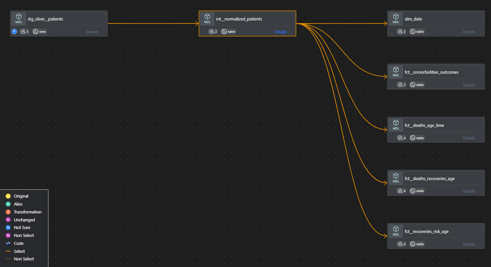

# DBT Transformations for COVID-19 Healthcare Pipeline

## Overview
This project implements a series of data transformations using dbt (Data Build Tool) to process and analyze healthcare data related to COVID-19. The transformations follow the Medallion Architecture, which organizes data into three layers: Staging (Bronze), Intermediate (Silver), and Marts (Gold). The final output is a clean and structured dataset in BigQuery, ready for visualization and analysis.

---

## Setting Up dbt Core

1. **Install dbt Core**:
   - Ensure you have Python installed on your system.
   - Install dbt using pip:
     ```bash
     pip install dbt-core dbt-bigquery
     ```

2. **Configure dbt Profile**:
   - Create a `profiles.yml` file in the `~/.dbt/` directory.
   - Add your BigQuery credentials and project details to the file. Example:
     ```yaml
     default:
       outputs:
         dev:
           type: bigquery
           method: service-account
           project: your-gcp-project-id
           dataset: your-dataset-name
           keyfile: path/to/your/credentials.json
           threads: 4
       target: dev
     ```

3. **Run dbt Commands**:
   - Test the connection:
     ```bash
     dbt debug
     ```
   - Run all models:
     ```bash
     dbt run
     ```
   - Test the models:
     ```bash
     dbt test
     ```

---

## Medallion Architecture



### 1. **Staging (Bronze Layer)**
   - **Purpose**: Ingest raw data from the source systems with minimal transformations.
   - **Model**: `stg_silver__patients`
     - Extracts data from the `covid19_dataset` source.
     - Cleans and standardizes fields such as `sex`, `classification`, and `patient_type`.
     - Handles null values and invalid codes for fields like `pneumonia`, `pregnant`, and `diabetes`.
   - **Output**: A cleaned staging table that serves as the foundation for further transformations.

### 2. **Intermediate (Silver Layer)**
   - **Purpose**: Normalize and enrich the data for analytical use.
   - **Model**: `int__normalized_patients`
     - Normalizes patient data by converting binary fields (e.g., `diabetes`, `asthma`) into `YES/NO` values.
     - Adds calculated fields such as `covid_classification`.
     - Ensures data consistency and prepares it for aggregation.
   - **Output**: A normalized dataset ready for aggregation and dimensional modeling.

### 3. **Marts (Gold Layer)**
   - **Purpose**: Create aggregated and dimensional models for reporting and visualization.
   - **Models**:
     - **Facts**:
       - `fct__comorbidities_outcomes`: Aggregates patient counts by comorbidity count and outcome (recovered or died).
       - `fct__deaths_age_time`: Summarizes monthly and yearly death counts by age group.
       - `fct__deaths_recoveries_age`: Provides total patients, deaths, and recoveries by patient type.
       - `fct__recoveries_risk_age`: Breaks down recoveries by risk level and age group.
     - **Dimensions**:
       - `dim_date`: Generates a date dimension table for time-based analysis.
   - **Output**: Clean, aggregated tables optimized for visualization tools like Tableau or Looker.

---

## Final Output in BigQuery
The transformations produce clean and structured tables in BigQuery. These tables can be used to:
   - Analyze trends in COVID-19 outcomes by age, comorbidities, and risk factors.
   - Visualize recovery and death rates over time.
   - Generate insights for healthcare decision-making and policy development.

By following the Medallion Architecture, the pipeline ensures data quality, scalability, and ease of use for downstream analytics.