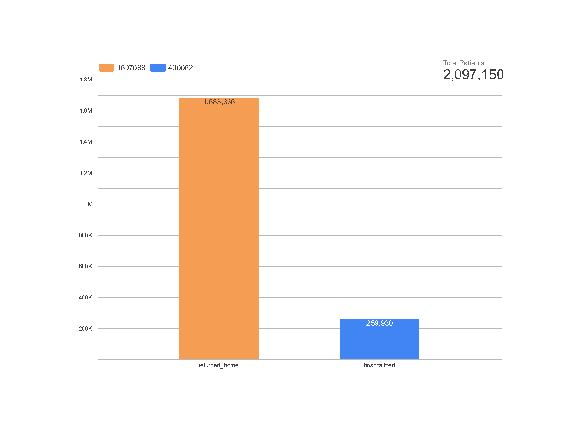
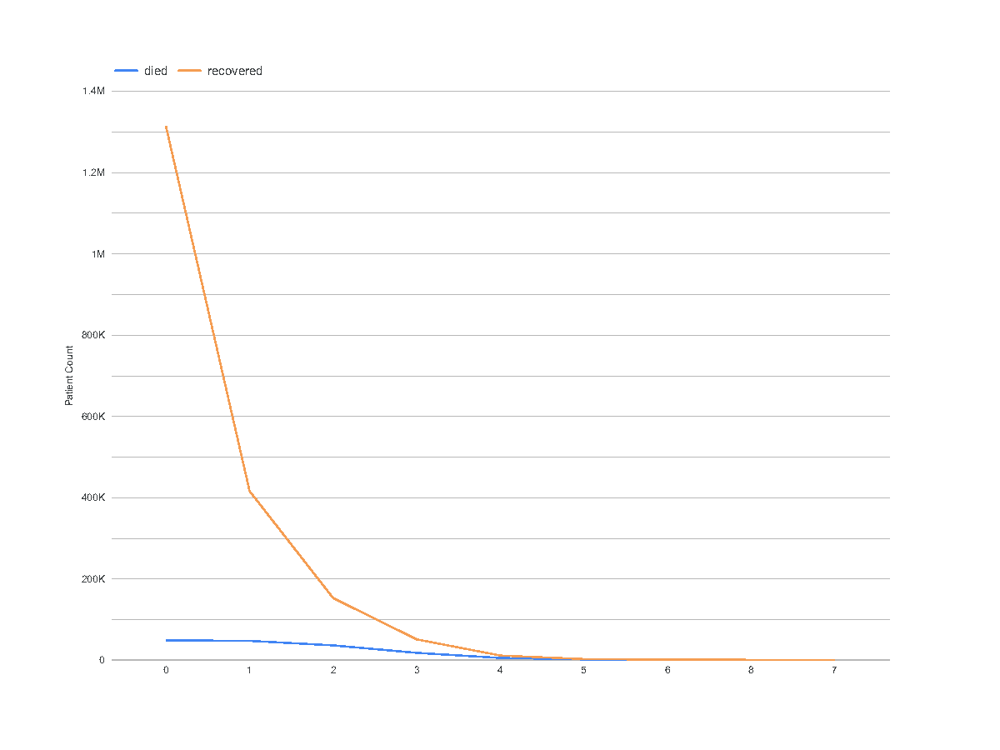
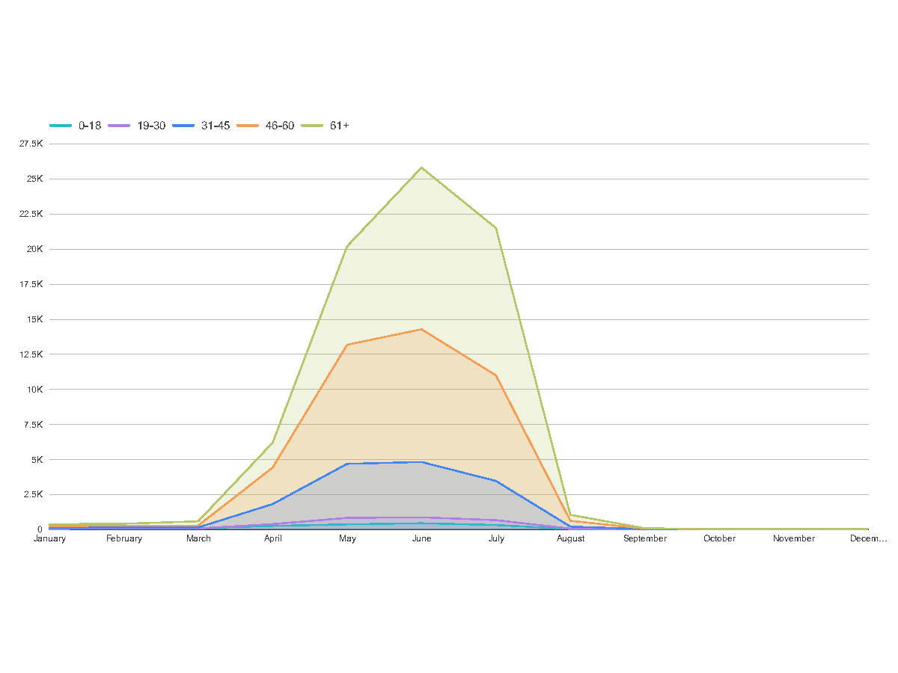
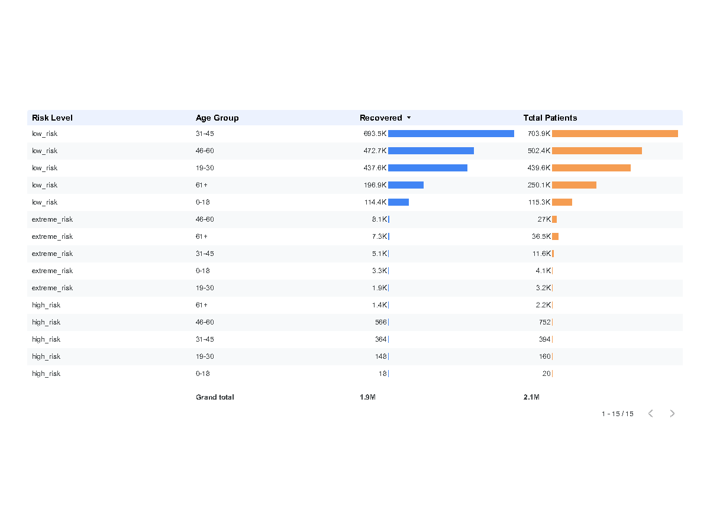

# COVID-19 Healthcare Dashboard

The COVID-19 pandemic was an unprecedented global health crisis that highlighted the critical need for data-driven decision-making in healthcare. As the virus spread rapidly across the globe, healthcare systems faced immense pressure to manage resources, predict outcomes, and prioritize care for the most vulnerable populations. In this context, creating pipelines to process and visualize healthcare data became essential for understanding trends, identifying risk factors, and informing public health strategies.

This dashboard presents key visualizations derived from healthcare data during the pandemic. These insights not only shed light on the challenges faced during the crisis but also emphasize the importance of robust data pipelines in enabling timely and actionable insights. By analyzing hospitalization outcomes, comorbidities, age-based mortality, and recovery trends, we can better prepare for future public health emergencies and improve patient care.

## Visualizations

1. **Hospitalization Outcomes**  
      
    This chart reflects one of the key trends observed during the COVID-19 pandemic: the majority of patients were able to recover at home without requiring hospitalization. While early pandemic fears predicted overwhelmed hospital systems, widespread testing and improvements in outpatient care meant that many individuals with mild to moderate symptoms avoided hospital stays altogether. This outcome also hints at the success of public health campaigns in helping individuals manage symptoms at home unless critical intervention was necessary. The data underscores the importance of triage and early detection in reducing the burden on hospitals during crisis periods.

2. **Comorbidities and Outcomes**  
      
    This graph explores how the presence of comorbidities impacted COVID-19 patient outcomes. As we move from left to right on the x-axis—representing patients with 0 to 7 comorbid conditions—we observe a sharp drop in the number of recovered patients. This decline illustrates how each additional underlying health issue (such as diabetes, hypertension, or COPD) compounded the risk of complications and prolonged illness. Interestingly, the line representing deaths does not rise as steeply, suggesting that while recovery becomes harder with more comorbidities, not all high-risk patients ultimately died. This points to the complexity of COVID-19 outcomes—where factors like healthcare access, age, and timely intervention often played as large a role as pre-existing conditions themselves.

3. **Deaths by Age Group**  
      
    Here, we look at the distribution of COVID-19 fatalities by age group during the pandemic’s first year, 2020—a period before mass vaccination and many medical advancements. The data is stark: the 61+ age group suffered the highest number of deaths, followed closely by individuals aged 46–60. These outcomes were consistent across the globe, as older adults were more likely to experience severe respiratory symptoms and complications. This age-based disparity in outcomes became one of the key reasons why governments prioritized older populations in early vaccination efforts. In hindsight, this graph reinforces the value of age as a primary risk factor during public health emergencies, and it supports continuing efforts to protect older adults in future outbreaks.

4. **Recovery by Risk Level and Age Group**  
      
    This visualization dives deeper into how both clinical risk level and age influenced recovery during the pandemic. Patients categorized as low risk—those who did not require intensive care or intubation—showed very high recovery rates across all age groups. In contrast, extreme-risk individuals, many of whom needed ICU support or ventilators, faced much worse outcomes, particularly in the 46–60 and 61+ age groups. Even among the high-risk category (patients with multiple health issues but not in critical condition), the majority of fatalities were in the 61+ group. With what we now know in 2025, these patterns helped validate early triage models and resource prioritization strategies in hospitals. The data also supports today’s more nuanced approach to defining “risk”—which goes beyond age alone to incorporate comorbidity profiles and treatment intensity.
